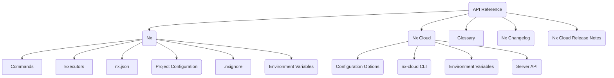

# Graph proposal

## Section view

### Get Started

```mermaid
graph TD;
  GetStarted(Get Started)-->NxIntro(Intro To Nx);;
  GetStarted-->Installation;
  GetStarted-->WhyNx(Why Nx);
  GetStarted-->5MinTutorialsNx(5 Min Tutorials);
    5MinTutorialsNx-->PackageBasedMonorepo(Package-Based monorepo);
    5MinTutorialsNx-->IntegratedMonorepo(Integrated monorepo);
    5MinTutorialsNx-->ReactStandalone(React standalone);
    5MinTutorialsNx-->AngularStandalone(Angular standalone);
    5MinTutorialsNx-->NodeStandalone(Node standalone);
  GetStarted-->CoreFeatures(Core Features);
    CoreFeatures-->RunTasks(Run Tasks);
    CoreFeatures-->CacheTaskResults(Cache Task Results);
    CoreFeatures-->ShareYourCache(Share Your Cache);
    CoreFeatures-->ExploretheGraph(Explore the Graph);
    CoreFeatures-->DistributeTaskExecution(Distribute Task Execution);
    CoreFeatures-->IntegratewithEditors(Integrate with Editors);
    CoreFeatures-->AutomateUpdatingDependencies(Automate Updating Dependencies);
  GetStarted-->PluginFeatures(Plugin Features);
    PluginFeatures-->UseTaskExecutors(Use Task Executors);
    PluginFeatures-->UseCodeGenerators(Use Code Generators);
    PluginFeatures-->EnforceProjectBoundaries(Enforce code boundaries);
  GetStarted-->Concepts;
    Concepts-->IntegratedReposPackage-BasedReposStandaloneApps(Integrated Repos vs. Package-Based Repos vs. Standalone Apps)
    Concepts-->MentalModel(Mental Model)
    Concepts-->Monorepos(Monorepos)
    Concepts-->HowCachingWorks(How Caching Works)
    Concepts-->ImproveWorstCaseCITimes(Improve Worst Case CI Times)
    Concepts-->TaskPipelineConfiguration(Task Pipeline Configuration)
    Concepts-->Affected(Affected)
    Concepts-->How-the-Project-Graph-is-Built(How the Project Graph is Built)
    Concepts-->Nx-Daemon(Nx Daemon)
    Concepts-->Architecture
      Architecture-->Folder-Structure(Folder Structure)
      Architecture-->Applications-and-Libraries(Applications and Libraries)
      Architecture-->Creating-Libraries(Creating Libraries)
      Architecture-->Library-Types(Library Types)
      Architecture-->Grouping-Libraries(Grouping Libraries)
      Architecture-->Buildable-and-Publishable-Libraries(Buildable and Publishable Libraries)
      Architecture-->Using-Nx-at-Enterprises(Using Nx at Enterprises)
      Architecture-->Micro-Frontend-Architecture(Micro Frontend Architecture)
      Architecture-->Dependency-Management(Dependency Management)
  GetStarted-->NxCloud(Nx Cloud)
    Nx-Cloud-->What-is-NxCloud(What is Nx Cloud);
    NxCloud-->SetUp(Set Up);
      SetUp-->Record-Non-Nx-Commands(Record Non-Nx Commands);
      SetUp-->Enable-GitHub-PR-Integration(Enable GitHub PR Integration);
      SetUp-->Enable-Bitbucket-Cloud-PR-Integration(Enable Bitbucket Cloud PR Integration);
      SetUp-->Enable-GitLab-MR-Integration(Enable GitLab MR Integration);
    NxCloud-->AccountManagement(Account Management);
      AccountManagement-->Users
      AccountManagement-->Authenticate-with-Google-Identity(Authenticate with Google Identity)
      AccountManagement-->Access-Tokens(Access Tokens)
      AccountManagement-->Security-Scenarios(Security Scenarios)
      AccountManagement-->End-to-End-Encryption(End to End Encryption)
    NxCloud-->NxCloudEnterprise(Running Nx Cloud Enterprise)
    NxCloud-->Illustrated-Distributed-Task-Execution(Illustrated Distributed Task Execution)
```

### Learn

### Plugins

```mermaid
graph TD;
  Plugins-->PluginsIntro(Intro);
    PluginsIntro-->Getting-Started-with-Plugins(Getting Started with Plugins)
    PluginsIntro-->Plugin-Registry(Plugin Registry)
      Plugin-Registry-->OfficialPlugins(Official)
        OfficialPlugins-->PackagesWorkspace
        OfficialPlugins-->PackagesDevkit
        OfficialPlugins-->PackagesAngular
        OfficialPlugins-->PackagesCypress
        OfficialPlugins-->PackagesDetox
        OfficialPlugins-->PackagesEsbuild
        OfficialPlugins-->PackagesEslint-Plugin
        OfficialPlugins-->PackagesExpo
        OfficialPlugins-->PackagesExpress
        OfficialPlugins-->PackagesJest
        OfficialPlugins-->PackagesJs
        OfficialPlugins-->PackagesLinter
        OfficialPlugins-->PackagesNest
        OfficialPlugins-->PackagesNext
        OfficialPlugins-->PackagesNode
        OfficialPlugins-->PackagesPlugin
        OfficialPlugins-->PackagesReact
        OfficialPlugins-->PackagesReact-Native
        OfficialPlugins-->PackagesRollup
        OfficialPlugins-->PackagesRspack
        OfficialPlugins-->PackagesStorybook
        OfficialPlugins-->PackagesVite
        OfficialPlugins-->PackagesWeb
        OfficialPlugins-->PackagesWebpack
      Plugin-Registry-->CommunityPlugins(Community)
        Community-->nx-dotnet
        Community-->qwik-nx
        Community-->jscutlery-semver(jscutlery/semver)
      Plugin-Registry-->ThirdParty(Third-party)
  Plugins-->5MinTutorialsPlugins(5 Min Tutorials);
    5MinTutorialsPlugins-->Create-a-Local-Plugin(Create a Local Plugin)
    5MinTutorialsPlugins-->Maintain-a-Published-Plugin(Maintain a Published Plugin)
```

### API Reference

# Additional notes

- `Nx-and-Turborepo(Nx and Turborepo)` should be just a link from `Why Nx?`, not a menu item.
- The same goes for some of the concepts in the core area
- Official packages should have just a link to them, optionally mutating the side menu with their own properties
